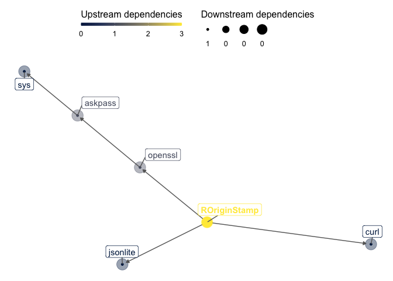

<!-- README.md is generated from README.Rmd. Please edit that file -->
[](https://travis-ci.org/rkrug/ROriginStamp)
[](https://www.tidyverse.org/lifecycle/#maturing)
[](https://codecov.io/github/rkrug/ROriginStamp?branch=master)

<!-- [](http://inch-ci.org/github/rkrug/ROriginStamp) -->

<!-- [CII Best Practices Badge](https://bestpractices.coreinfrastructure.org/en/projects/2094) -->

-------

```{r setup, include = FALSE, eval = TRUE}
knitr::opts_chunk$set(
  echo    = TRUE,
  eval    = FALSE,
  comment = "",
  cache   = TRUE
)
library(ROriginStamp)

valid_key <- openssl::sha1(api_key()) == "4a0b1541d679c18ed81b2ee79052984cd6ab5597"
```

# Dependencies

This package aims at minimising the number of dependencies It has at the moment only three direct dependencies, which are not avoidable as `curl` [@curlR] is used to access the [OriginStamp](https://originstamp.com) API, `openssl` [@opensslR] to calculate the hashes, and `jsonlite` [@jsonliteR] to encode and decode the API communications. The dependency graph looks as followes: 

```{r dep_graph, eval=FALSE, include=FALSE}
# if (!file.exists()) {
  depgraph::plot_dependency_graph(here::here(), suggests = FALSE)
# } else {
```



# Overview
This packages allows to obtain Trusted Timestamps (TTS) from [OriginStamp](https://originstamp.com) for R objects and files. To obtain the TTS, the sha256 hashes are calculated of the object using [OpenSSL](https://www.openssl.org) by using the opennssl R package [@opensslR].

## Background

### What are Trusted Timestamps?

From [Wikipedia](https://en.wikipedia.org/wiki/Trusted_timestamping)

> Trusted timestamping is the process of securely keeping track of the creation and modification time of a document. Security here means that no one—not even the owner of the document—should be able to change it once it has been recorded provided that the timestamper's integrity is never compromised.

This allows you, "to prove that [you are] the originator of certain information at a given point in time" (from [OriginStamp documentation](https://docs.originstamp.com/guide/#about-this-documentation)).

Examples are to prof that you generated the data at a given time, proof that you had the data before anybody else, etc.

### How is it done

I will cite from the [OriginStamp documentation](https://docs.originstamp.com/guide/#introduction):

> OriginStamp is a web-based, trusted timestamping service that uses the decentralized blockchain to store anonymous, tamper-proof time stamps for any digital content. OriginStamp allows users to hash files, emails, or plain text, and subsequently store the created hashes in the blockchain as well as retrieve and verify time stamps that have been committed to the blockchain. OriginStamp is free of charge and easy to use.

A detailed description on how their approach works, can also be found in [their documentation](https://docs.originstamp.com/guide/originstamp.html#preparation-of-digital-content).


## Prerequisites

Before you can use the package, you have to get an API key from [OriginStamp](https://docs.originstamp.com). For details, see their [Get anAPI key documentation](https://docs.originstamp.com/guide/gettingstarted.html#get-an-api-key).

## Installation

`ROriginStamp` is momentarily only available on github, so you have to install it by using devtools:

```{r install}
if (!require(devtools)) {
  install.packages("devtools")
  library(devtools)
}
devtools::install_github("rkrug/ROriginStamp")
```

# How to use it

## Hashing

This package is based on sha256 hashes as calculated by the openssl package by @opensslR as OriginStamp is using sha256 hashes.

The function `hash(x)` is the workhorse for calculating hashes. It calculates sha256 from R objects as well as, from files. It returns an object of class `hash`, which is simply a character vector of length 1 with the class `hash` assigned.

The hash is calculated when

1. `x` is a character vector,
2. if the `length(x)` is one, and
3. `x` points to an existing file.

If you want to calculate the hash of an character vector of length one which is also a file name to an existing file, 

```{r,  eval = TRUE}
hash(system.file("DESCRIPTION", package = "ROriginStamp"))
```

returns the hash of the file.
This is identical to directly call the hash method which calculates the hash of the file:

```{r,  eval = TRUE}
hash.file(system.file("DESCRIPTION", package = "ROriginStamp"))
```

If you want to calculate the hash of the actual R object, you have to method which handles all R objects:

```{r, eval = TRUE}
hash.default(system.file("DESCRIPTION", package = "ROriginStamp"))
```

If `x` is an object of class `hash`, the object x is returned as is:
```{r, eval = TRUE}
identical( 
  hash(letters), 
  hash(hash(letters))
)
```

## Preparation

If you want to do anything more than hashing with this package, you have to register with [OriginStamp](https://originstamp.com) and get an API key. You can register for a free account and still use all the functionality of this package.
To get an API key is described in the [Get an API key section](https://docs.originstamp.com/guide/gettingstarted.html#get-an-api-key) of the documentation. 

To make this key available to the package, you have to

1. either set it as an environmental variable, by e.g. using 

```{r, eval = FALSE, include = TRUE}
Sys.setenv(ROriginStamp_api_key = "xxxxxxxx-xxxx-xxxx-xxxx-xxxxxxxxxxxx")
```
or
2. use the `api_key()` function to set the api key by running 
```{r, eval = FALSE, include = TRUE }
api_key("xxxxxxxx-xxxx-xxxx-xxxx-xxxxxxxxxxxx")`
````


## `get_key_usage()` - Getting infomation about your OriginStamp account

To get the key usage statistics is accomplished by using

```{r get_key_usage, eval = valid_key}
get_key_usage()
```

This gives an overview over your usage of your credits. The actual numbers depend on the plan you are on and the number of credits used already.

For a detailed description of the return value see [the Default«UsageResponse» in the models section](https://api.originstamp.com/swagger/swagger-ui.html#/) of the API documentation.


## `get_currencies()` - Getting infomation about your OriginStamp account

OriginStamp can work with different blockchain based currencies. The list of the currencies supported can be retrieved by using

```{r get_currencies, eval = valid_key}
get_currencies()
```

For a detailed description of the return value see [the DefaultOfListOfCurrencyModel in the models section](https://api.originstamp.com/swagger/swagger-ui.html#/) of the API documentation.

## `create_timestamp()` - Create a new timestamp

Let's create a new timestamp.

As an example, let's create a timestamp for 100 random numbers, to make sure, that the hash has not been timestamped by OriginStamp already. 

```{r create_timestamp, eval = valid_key}
obj <- runif(100)
create_timestamp(
  x = obj, 
  comment = "This is a dummy test for creating a timestamp."
)
```

Now let's submit the same hash again and see what happens:

```{r create_timestamp_second_time, eval = valid_key}
create_timestamp(
  x = obj, 
  comment = "This is a dummy test for creating a timestamp a second time."
)
```

The difference is in `$content$data$created` which is `TRUE` when the submitted hash has not been timestamped already and subsequently created, and `FALSE` when it already exists. This is an easy way to check if the submission was successful. 

It is important to note, that the timestamps are not created immediately, but put in a bash cue, which is submitted at certain intervalls, depending on the currency used. See [the documentation on currencies](https://docs.originstamp.com/guide/#blockchain-currencies) for details. 

## `get_hash_status()` - Getting the status of a submitted hash

Let's get information about the status of some hashes submitted. We start with the status of the just submitted hash of `obj`

```{r get_hash_status, eval = valid_key}
get_hash_status(
  x = obj
)
```


Now lets look at the status of a hash submitted in the past and which is already processed and timestamped:
```{r get_hash_status_old, eval = valid_key}
get_hash_status(
  x = as.hash("2c5d36be542f8f0e7345d77753a5d7ea61a443ba6a9a86bb060332ad56dba38e")
)
```

The difference is in `$content$data$timestamps` which is in the case of a submitted hash but not yet created timestamp an essentially empty table, while in the case of a created timestamp, a table lie=sting the timestamp information. 

But this information is neither particularly useful, nor userfriendly if one wan's to proof the timestamp. For this, let's move the final command.

## `get_proof()` - Downloading proof of a created timestamp

The structure of the command is very similar to the previous one, only that one can specify the type of the proof. This can be either in the form of a `pdf` file (a 'certificate'), or as an xml file (a 'proof').

```{r get_proof_pdf, eval = FALSE}
get_proof(
  x = as.hash("2c5d36be542f8f0e7345d77753a5d7ea61a443ba6a9a86bb060332ad56dba38e"), 
  proof_type = "pdf"
)
```

or

```{r get_proof_xml, eval = FALSE}
get_proof(
  x = as.hash("2c5d36be542f8f0e7345d77753a5d7ea61a443ba6a9a86bb060332ad56dba38e"), 
  proof_type = "xml"
)
```

The function returns an object containing the url where the document can be downloaded (`$content$data$download_url`) which is automatically processed further and the document is downloaded. As file name, the argument `file` is used. If it is not provided, the file name in the return value is used, which is of the format \code{proof.CURRENCY.HASH.xml} for \code{proof_type == "xml"} or \code{certificate.CURRENCY.HASH.pdf} for \code{proof_type == "pdf"}

To see the downloaded files, click [here for the pdf](./inst/certificate.Bitcoin.2c5d36be542f8f0e7345d77753a5d7ea61a443ba6a9a86bb060332ad56dba38e.pdf) or [here for the xml](./inst/proof.Bitcoin.2c5d36be542f8f0e7345d77753a5d7ea61a443ba6a9a86bb060332ad56dba38e.xml).

# References

