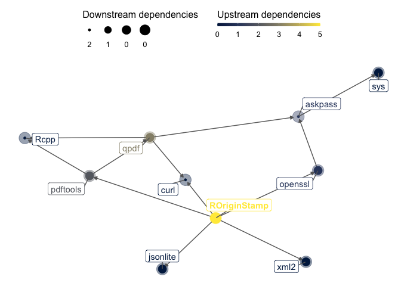

ROriginStamp - a simple interface to
[OriginStamp](https://originstamp.org/)
================

-   [Overview](#overview)
    -   [Background](#background)
        -   [What are Trusted Timestamps?](#what-are-trusted-timestamps)
        -   [How is it done](#how-is-it-done)
    -   [Prerequisites](#prerequisites)
    -   [Installation](#installation)
    -   [Usage](#usage)
        -   [Obtain a TTS for an object or
            file](#obtain-a-tts-for-an-object-or-file)
        -   [Download certificate for an
            object](#download-certificate-for-an-object)

<!-- README.md is generated from README.Rmd. Please edit that file -->
<!-- badges: start -->

[](https://doi.org/10.5281/zenodo.4588336)

[](https://github.com/rkrug/ROriginStamp/actions/workflows/ci-eb.yaml)
[](https://codecov.io/github/rkrug/ROriginStamp?branch=master)

[](https://www.tidyverse.org/lifecycle/#maturing)
[](https://www.repostatus.org/#active)
<!-- badges: end -->

<!-- [](http://inch-ci.org/github/rkrug/ROriginStamp) -->
<!-- [CII Best Practices Badge](https://bestpractices.coreinfrastructure.org/en/projects/2094) -->

------------------------------------------------------------------------

For the documentation see <https://rkrug.github.io/ROriginStamp/> \#
Dependencies

This package aims at minimizing the number of dependencies It has at the
moment only three direct dependencies, which are not avoidable as `curl`
([Ooms 2019](#ref-curlR)) is used to access the
[OriginStamp](https://originstamp.com) API, `openssl` ([Ooms
2020](#ref-opensslR)) to calculate the hashes, and `jsonlite` ([Ooms
2014](#ref-jsonliteR)) to encode and decode the API communications. The
dependency graph looks as followes:



# Overview

This packages allows to obtain Trusted Timestamps (TTS) from
[OriginStamp](https://originstamp.com) for R objects and files. To
obtain the TTS, the sha256 hashes are calculated and submitted to
[OriginStamp](https://originstamp.com)

## Background

### What are Trusted Timestamps?

From [Wikipedia](https://en.wikipedia.org/wiki/Trusted_timestamping)

> Trusted timestamping is the process of securely keeping track of the
> creation and modification time of a document. Security here means that
> no one—not even the owner of the document—should be able to change it
> once it has been recorded provided that the timestamper’s integrity is
> never compromised.

This allows you, “to prove that \[you are\] the originator of certain
information at a given point in time” (from [OriginStamp
documentation](https://docs.originstamp.com/guide/#about-this-documentation)).

Examples are to prof that you generated the data at a given time, proof
that you had the data before anybody else, etc.

### How is it done

I will cite from the [OriginStamp
documentation](https://docs.originstamp.com/guide/#introduction):

> OriginStamp is a web-based, trusted timestamping service that uses the
> decentralized blockchain to store anonymous, tamper-proof time stamps
> for any digital content. OriginStamp allows users to hash files,
> emails, or plain text, and subsequently store the created hashes in
> the blockchain as well as retrieve and verify time stamps that have
> been committed to the blockchain. OriginStamp is free of charge and
> easy to use.

A detailed description on how their approach works, can also be found in
[their
documentation](https://docs.originstamp.com/guide/originstamp.html#preparation-of-digital-content).

## Prerequisites

Before you can use the package, you have to get an API key from
[OriginStamp](https://docs.originstamp.com). For details, see their [Get
anAPI key
documentation](https://docs.originstamp.com/guide/gettingstarted.html#get-an-api-key).

## Installation

`ROriginStamp` is momentarily only available on github, so you have to
install it by using devtools:

``` r
if (!require(devtools)) {
  install.packages("devtools")
  library(devtools)
}
devtools::install_github("rkrug/ROriginStamp")
```

## Usage

This package makes it easy to obtain and verify a hashed object or file
in R, after getting an API key as described above.

### Obtain a TTS for an object or file

``` r
create_timestamp(
  x = obj, 
  comment = "This is a dummy test for creating a timestamp."
)
```

where obj can be an R object or filename, and the TTS is for the R
object or the file the filename obj points to.

### Download certificate for an object

``` r
get_proof(
  x = obj, 
  proof_type = "pdf"
)
```

will download a pdf certificate of the R object or filename, while

``` r
get_proof(
  x = obj, 
  proof_type = "xml"
)
```

will download an xml file which can be verified using an approach
otlined on the OriginStamp website.

<div id="refs" class="references csl-bib-body hanging-indent">

<div id="ref-jsonliteR" class="csl-entry">

Ooms, Jeroen. 2014. “The Jsonlite Package: A Practical and Consistent
Mapping Between JSON Data and r Objects.” *arXiv:1403.2805 \[Stat.CO\]*.
<https://arxiv.org/abs/1403.2805>.

</div>

<div id="ref-curlR" class="csl-entry">

———. 2019. *Curl: A Modern and Flexible Web Client for r*.
<https://CRAN.R-project.org/package=curl>.

</div>

<div id="ref-opensslR" class="csl-entry">

———. 2020. *Openssl: Toolkit for Encryption, Signatures and Certificates
Based on OpenSSL*. <https://CRAN.R-project.org/package=openssl>.

</div>

</div>
